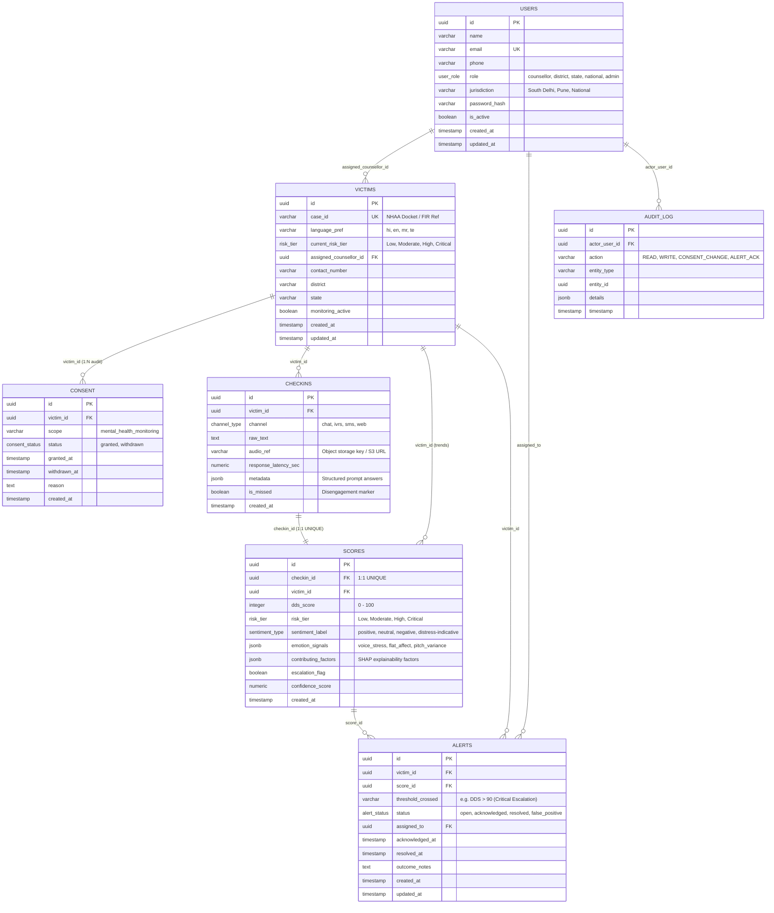
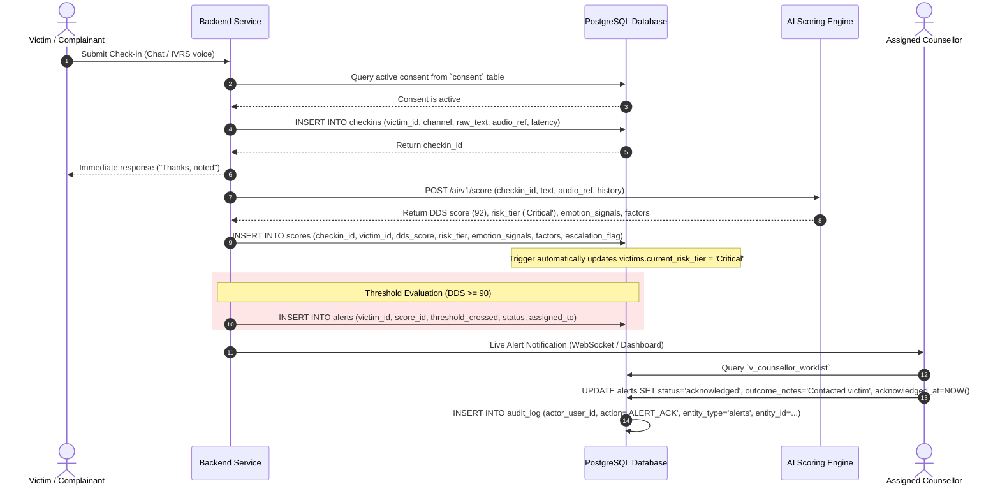
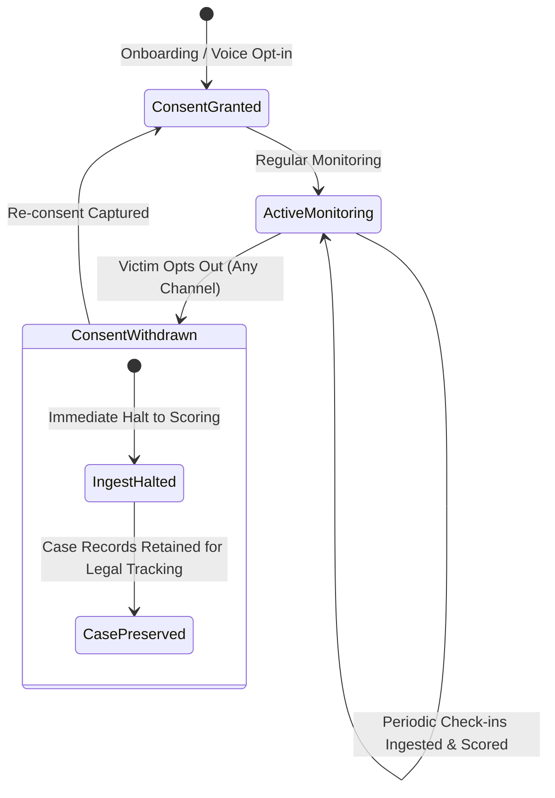

# Visual Walkthrough: PostgreSQL Database Architecture (SIH26094)
## AI-Powered Dynamic Mental Health Monitoring and Distress Prediction System

---

## 1. Complete Entity-Relationship (ER) Architecture



---

## 2. Check-in to Alert Lifecycle Sequence Diagram



---

## 3. DPDP Act 2023 Consent Lifecycle State Diagram



---

## 4. Key Performance Indexes & Optimization Strategy

```
  TABLE: checkins
  └── idx_checkins_victim_created: (victim_id, created_at DESC) -> B-tree for fast trend history
  └── idx_checkins_channel: (channel)                            -> B-tree for channel analytics
  └── idx_checkins_metadata_gin: (metadata)                      -> GIN index for JSONB prompt filters

  TABLE: scores
  └── idx_scores_checkin_id: (checkin_id) UNIQUE                 -> B-tree for 1:1 lookups
  └── idx_scores_victim_created: (victim_id, created_at DESC)   -> B-tree for longitudinal graphs
  └── idx_scores_risk_tier: (risk_tier)                          -> B-tree for tier filtering
  └── idx_scores_escalation: (escalation_flag) WHERE TRUE        -> Partial index for rapid alert audits
  └── idx_scores_emotion_gin: (emotion_signals)                  -> GIN index for acoustic signal queries
  └── idx_scores_factors_gin: (contributing_factors)             -> GIN index for explainability queries

  TABLE: alerts
  └── idx_alerts_assigned_status: (assigned_to, status)          -> B-tree for counsellor worklist
  └── idx_alerts_status_created: (status, created_at DESC)       -> B-tree for active alert sorting
```

---

## 5. Verification & Query Execution Guide

### A. Counsellor Worklist (Prioritized Active Alerts)
```sql
SELECT 
    alert_id,
    case_id,
    current_risk_tier,
    dds_score,
    sentiment_label,
    contributing_factors,
    checkin_channel,
    checkin_text
FROM v_counsellor_worklist
WHERE alert_status = 'open';
```

### B. Victim Longitudinal Trajectory (Dashboard Sparkline)
```sql
SELECT 
    checkin_time,
    channel,
    dds_score,
    risk_tier,
    dds_score_delta,
    emotion_signals->>'voice_stress' AS voice_stress
FROM v_victim_distress_trends
WHERE case_id = 'NHAA-2026-DL-00101'
ORDER BY checkin_time ASC;
```

### C. District & National Summary View
```sql
SELECT * FROM v_district_state_summary;
```
