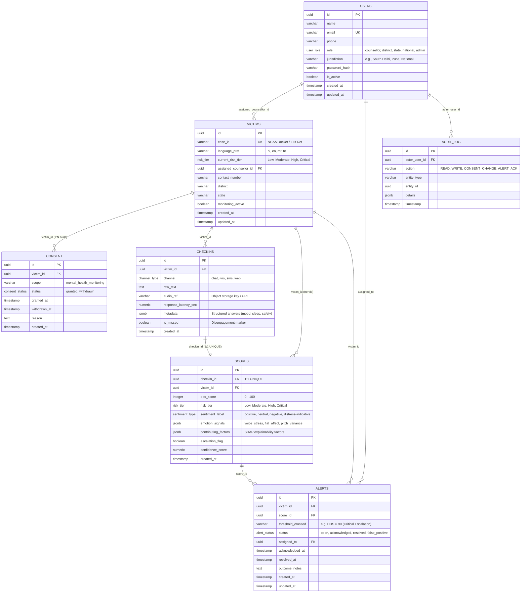

# AI-Powered Dynamic Mental Health Monitoring System (SIH26094)
## Enterprise PostgreSQL Database Architecture & Schema Specification

This database architecture is built strictly conforming to the **System Architecture Document** (Section 4, Figure 3 ER Diagram) and **Product Requirements Document (PRD)** for **SIH Problem Statement SIH26094 (Ministry of Social Justice and Empowerment - MoSJE)**.

---

## 1. Domain Modeling & Architectural Highlights

### A. DPDP Act 2023 Compliance & Privacy-by-Design
- **1:1 Separation of `checkins` and `scores`**:
  - `checkins` stores raw multi-channel interactions (text, audio references, prompt responses, response latency).
  - `scores` stores derived AI outputs (DDS score 0-100, emotion signals, XAI SHAP contributing factors).
  - *Rationale*: Allows different access-control, masking, and retention policies on raw conversational data vs. numerical analytical metrics.
- **Dedicated `consent` Ledger**:
  - Rather than a boolean flag on `victims`, withdrawal creates a new entry preserving the timeline for legal and regulatory compliance.
- **Immutable `audit_log` Table**:
  - Captures every read, write, consent modification, or alert acknowledgement touching a victim record to answer *"who looked at this case, when, and what was accessed"*.

### B. High-Performance JSONB for AI Signals
- **`emotion_signals` (JSONB + GIN Index)**:
  - Stores voice acoustics: `{"voice_stress": 0.94, "flat_affect": 0.88, "pitch_variance": 0.08, "speech_rate": 65}`.
- **`contributing_factors` (JSONB + GIN Index)**:
  - Stores explainable AI (XAI) factors: `["Explicit crisis call for help", "High acoustic vocal tremor", "Response latency spike >18s"]`.

### C. Automated Triggers & Data Integrity
- **`trg_sync_victim_risk_tier`**: Automatically keeps `victims.current_risk_tier` updated in real time whenever a new AI score is inserted.
- **`update_timestamp_column()`**: Maintains `updated_at` timestamps on all mutable entities.

---

## 2. Entity-Relationship (ER) Schema Overview



---

## 3. Directory Layout

```
database/
├── schema.sql      # Complete DDL (Extensions, ENUMs, Tables, Constraints, Indexes, Triggers)
├── views.sql       # Analytical Views for Counsellor Worklist, Trends, and Summary KPIs
├── seed.sql        # Realistic synthetic dataset modeling multi-day escalation trajectory
└── README.md       # Architectural documentation and deployment guide
```

---

## 4. Execution & Deployment Guide

### A. Deploying to Vercel Postgres / Neon / Supabase
1. Navigate to your **Vercel Dashboard** &rarr; **Storage** &rarr; **Create Database** &rarr; **Postgres (powered by Neon)** (or Supabase console).
2. Open the **SQL Editor / Query Console**.
3. Execute the SQL scripts in this exact order:
   - **Step 1:** Run [`database/schema.sql`](file:///c:/Users/araaf%20shamim/OneDrive/Desktop/ai%20based%20stress%20management%20system/AI-based-stress-monitoring-system/database/schema.sql)
   - **Step 2:** Run [`database/views.sql`](file:///c:/Users/araaf%20shamim/OneDrive/Desktop/ai%20based%20stress%20management%20system/AI-based-stress-monitoring-system/database/views.sql)
   - **Step 3:** Run [`database/seed.sql`](file:///c:/Users/araaf%20shamim/OneDrive/Desktop/ai%20based%20stress%20management%20system/AI-based-stress-monitoring-system/database/seed.sql)

### B. Executing via `psql` CLI
```bash
# Connect to your PostgreSQL database instance
psql "<YOUR_POSTGRES_CONNECTION_STRING>" -f database/schema.sql
psql "<YOUR_POSTGRES_CONNECTION_STRING>" -f database/views.sql
psql "<YOUR_POSTGRES_CONNECTION_STRING>" -f database/seed.sql
```

---

## 5. Analytical Views & Verification Queries

### 1. Counsellor Worklist (Prioritized active alerts with check-in context)
```sql
SELECT 
    alert_id,
    case_id,
    current_risk_tier,
    dds_score,
    sentiment_label,
    contributing_factors,
    checkin_channel,
    checkin_text
FROM v_counsellor_worklist
WHERE alert_status = 'open';
```

### 2. Longitudinal Trend Sparkline per Victim
```sql
SELECT 
    checkin_time,
    channel,
    dds_score,
    risk_tier,
    dds_score_delta,
    emotion_signals->>'voice_stress' AS voice_stress
FROM v_victim_distress_trends
WHERE case_id = 'NHAA-2026-DL-00101'
ORDER BY checkin_time ASC;
```

### 3. District & State Risk Summary (Administrative Dashboard)
```sql
SELECT * FROM v_district_state_summary;
```
